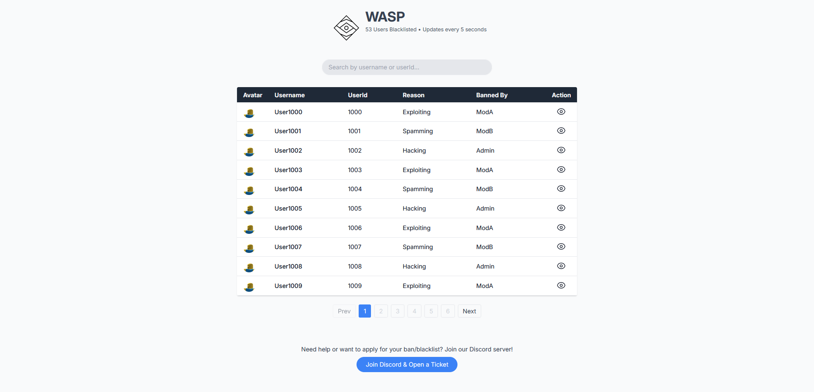
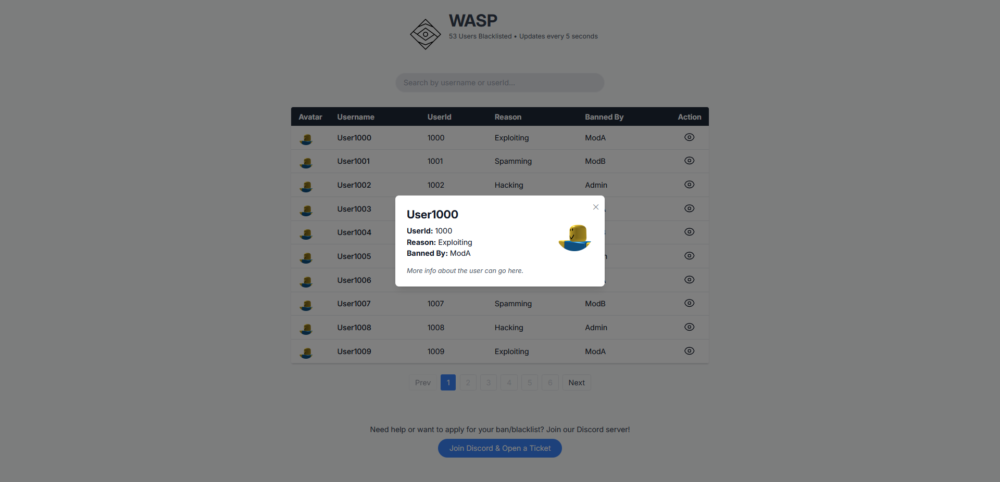

# Worldwide Asset & Server Protection - Website

- 📖 [Remix docs](https://remix.run/docs)

## Development

Run the dev server:

```sh
npm run dev
```

## Deployment

First, build your app for production:

```sh
npm run build
```

Then run the app in production mode:

```sh
npm start
```

Now you'll need to pick a host to deploy it to.

## Screenshots



